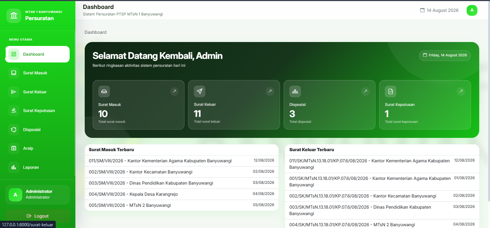

# Sistem Informasi Persuratan

Sistem Informasi Persuratan merupakan aplikasi berbasis web yang dikembangkan untuk membantu pengelolaan administrasi surat pada instansi secara lebih terstruktur, terpusat, dan terdokumentasi.

Aplikasi ini dikembangkan sebagai bagian dari kegiatan **Praktik Kerja Lapangan (PKL)** dengan fokus pada digitalisasi pengelolaan surat masuk, surat keluar, disposisi, surat keputusan, serta arsip dokumen.

## ✨ Fitur

### Surat Masuk

* Menambahkan data surat masuk
* Mengubah data surat
* Menghapus data surat
* Melihat detail surat
* Upload dan penyimpanan dokumen
* Pencarian dan filtering data

### Surat Keluar

* Menambahkan data surat keluar
* Mengubah data surat
* Menghapus data surat
* Melihat detail surat
* Upload dan penyimpanan dokumen
* Pencarian dan filtering data

### Disposisi

* Membuat disposisi berdasarkan surat masuk
* Menentukan tujuan disposisi
* Menentukan sifat surat
* Menambahkan catatan disposisi
* Melihat detail disposisi
* Mencetak dokumen disposisi

### Surat Keputusan

* Menambahkan data Surat Keputusan
* Mengubah dan menghapus data SK
* Upload dokumen SK
* Melihat detail dokumen
* Download dokumen

### Laporan

* Menyediakan laporan data persuratan
* Export/cetak laporan dalam format PDF

### Authentication

* Login pengguna
* Logout
* Proteksi halaman menggunakan authentication middleware

### Penyimpanan Dokumen

Dokumen surat dapat diintegrasikan dengan **Google Drive** sebagai media penyimpanan file.

---

## 🛠️ Tech Stack

| Teknologi                | Penggunaan                      |
| ------------------------ | ------------------------------- |
| **Laravel 9**            | Backend & application framework |
| **PHP 8.4**              | Bahasa pemrograman              |
| **MariaDB**              | Database                        |
| **Bootstrap 5**          | User interface                  |
| **Blade**                | Template engine                 |
| **Laravel Breeze**       | Authentication                  |
| **Tom Select**           | Input autocomplete & select     |
| **Google Drive API**     | Penyimpanan dokumen             |
| **DomPDF / PDF Library** | Pembuatan laporan PDF           |
| **PHPWord**              | Pembuatan dokumen disposisi     |
| **Composer**             | Dependency management           |
| **Git & GitHub**         | Version control                 |

---

## 📋 Requirements

Sebelum menjalankan project, pastikan environment sudah memiliki:

* PHP >= 8.1
* Composer
* MariaDB / MySQL
* Node.js & NPM
* Git
* Web server lokal seperti Laragon, XAMPP, atau sejenisnya

---

## 🚀 Installation

Clone repository:

```bash
git clone https://github.com/AIFProject/persuratan.git
cd persuratan
```

Install dependency PHP:

```bash
composer install
```

Install dependency frontend:

```bash
npm install
```

Copy file environment:

```bash
cp .env.example .env
```

Pada Windows, dapat menggunakan:

```bash
copy .env.example .env
```

Generate application key:

```bash
php artisan key:generate
```

---

## ⚙️ Environment Configuration

Sesuaikan konfigurasi database pada file `.env`:

```env
APP_NAME="Sistem Informasi Persuratan"
APP_ENV=local
APP_KEY=
APP_DEBUG=true
APP_URL=http://localhost:8000

DB_CONNECTION=mysql
DB_HOST=127.0.0.1
DB_PORT=3306
DB_DATABASE=persuratan
DB_USERNAME=root
DB_PASSWORD=
```

Sesuaikan nilai database dengan konfigurasi MariaDB/MySQL pada komputer masing-masing.

---

## 🗄️ Database

Buat database terlebih dahulu, kemudian jalankan migration:

```bash
php artisan migrate
```

Untuk menjalankan migration sekaligus seeder:

```bash
php artisan migrate --seed
```

> Gunakan `migrate:fresh --seed` hanya pada environment development karena perintah tersebut akan menghapus seluruh tabel dan membuatnya kembali.

---

## ☁️ Google Drive

Aplikasi mendukung penyimpanan dokumen menggunakan Google Drive.

Konfigurasi Google Drive membutuhkan kredensial OAuth yang disimpan pada file `.env`.

Contoh konfigurasi:

```env
GOOGLE_CLIENT_ID=
GOOGLE_CLIENT_SECRET=
GOOGLE_REFRESH_TOKEN=
GOOGLE_DRIVE_FOLDER_ID=
```

Folder penyimpanan dapat disesuaikan dengan kebutuhan aplikasi.

> **Catatan keamanan:** jangan pernah commit file `.env`, credential OAuth, refresh token, atau informasi rahasia lainnya ke repository GitHub.

---

## ▶️ Menjalankan Aplikasi

Jalankan development server Laravel:

```bash
php artisan serve
```

Kemudian buka:

```text
http://localhost:8000
```

Untuk menjalankan frontend asset:

```bash
npm run dev
```

---

## 📁 Struktur Modul

Struktur utama aplikasi dibagi menjadi beberapa modul:

```text
app/
├── Http/
│   ├── Controllers/
│   └── Requests/
├── Models/
├── Services/
└── ...

resources/
├── views/
│   ├── layouts/
│   ├── surat-masuk/
│   ├── surat-keluar/
│   ├── disposisi/
│   └── surat-keputusan/
└── ...

routes/
└── web.php

database/
├── migrations/
└── seeders/
```

---

## 🔐 Security

Beberapa konfigurasi penting sebelum aplikasi digunakan pada environment production:

* Set `APP_ENV=production`
* Set `APP_DEBUG=false`
* Jangan commit `.env`
* Gunakan credential Google Drive yang aman
* Batasi akses berdasarkan role/permission
* Pastikan dokumen persuratan tidak dapat diakses secara publik tanpa authorization
* Gunakan HTTPS pada server production
* Lakukan backup database dan dokumen secara berkala

---

## 📌 Status Project

**Stable Release**

Fitur utama sistem telah selesai dikembangkan dan dapat digunakan untuk pengelolaan administrasi persuratan meliputi Surat Masuk, Surat Keluar, Disposisi, Surat Keputusan, pengarsipan dokumen, dan pembuatan laporan PDF.

---

## 🖼️ Screenshot

Tambahkan screenshot halaman aplikasi pada bagian ini, misalnya:

* Dashboard
* Surat Masuk
* Surat Keluar
* Detail Surat
* Disposisi
* Surat Keputusan
* Laporan

Contoh:

```md

```

---

## 🎯 Tujuan Pengembangan

Aplikasi ini dikembangkan untuk membantu proses administrasi persuratan agar:

* Data surat lebih terorganisir
* Proses pencatatan lebih cepat
* Dokumen lebih mudah ditemukan
* Arsip dapat dikelola secara digital
* Proses disposisi lebih terdokumentasi
* Pembuatan laporan menjadi lebih mudah

---

## 👨‍💻 Developer

Developed by **MH. Abyan Siddiqi**

GitHub:
https://github.com/AIFProject

Repository:
https://github.com/AIFProject/persuratan

---

## 📄 License

Project ini dikembangkan untuk kebutuhan Praktik Kerja Lapangan dan pengembangan sistem informasi persuratan.
